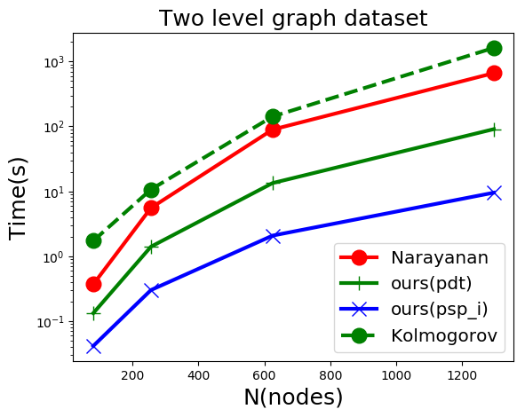

We compare the running speed of 4 implementations for principal sequence of partition.

Two types of graph are used: Gaussian and Two-Level graph.

Average over 3 times on each datapoint.


## Multi-processing
```shell
python alg_speed.py --num_times=2 --node_size=200 --method=dt --total_times --multi_thread
```
The multi-processing mode can speed up the program a lot. Suppose your computer has n cores and 
you average the results n times for each algorithm and input data configuration ( to get the
expectation ), then You can get n times speed up since each running is indepedent with each other. 
